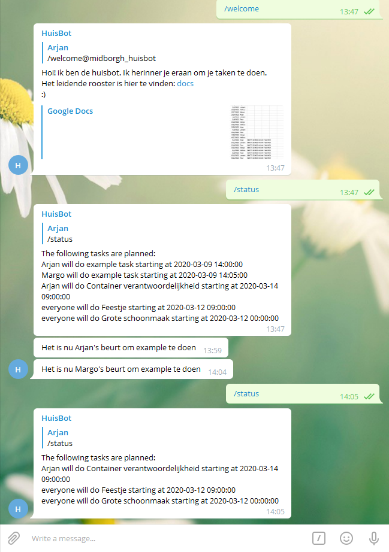

# huisBot

A python-telegram bot to more efficiently organize tasks. Made with student dorms in mind.

## Installation
To install huisBot on a server, you can use this very lazy script:

bash <(curl -Ss https://raw.githubusercontent.com/ajvreugdenhil/huisBot/dev/installscript)

Or manually clone/download the repo, install dependencies and run setup.sh

## About
The idea for huisBot was born when once again, the household chores started to be missed every so often and the work started piling up. Depending on the structure of how the work is distributed, and on where that information is stored, these might be small inconveniences that lead to people not checking the schedule, leading to work being skipped. 

HuisBot aims to solve this problem by eliminating the need to look at the schedule, and instead bring the schedule to the person. Possible future features include asking the person if the task is completed, increasing the social pressure by a large factor.

## Features
Currently, the bot serves a welcome message on request. This message can for example link to a file with house rules and other information, hosted elsewhere online. This message is formatted in markdown.

Using JSON, one can make a schedule of static tasks. These have an assignee, who is mentioned when the start time of the task is reached. The text for this message is customizable.

It is also possible to make a list of subtasks, and of assignees, and generate messages based on this. This eliminates the need for making long cleaning schedules by hand.

The bot works in multiple groups at the same time. Thread safety has not been assessed.

## Upcoming features
Because this is a short project, mostly aimed at teaching myself python, advances of this project are not guaranteed. You are welcome to submit pull requests. Features in consideration include:

- Advanced tasks (get the dates of when the garbage truck comes by)
- Stateful interaction (make it a little more user friendly)
- Data exportation (A nice pdf of the planning to hang in the living room)